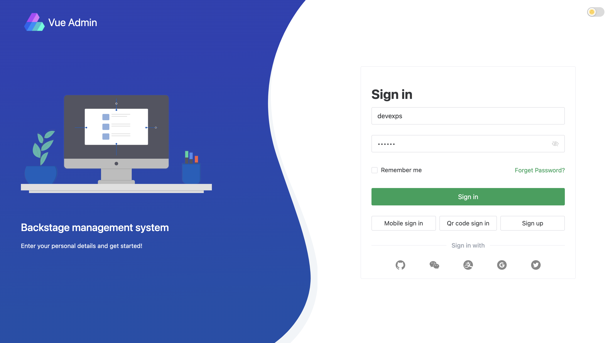

# Vue Admin
Backstage Management System compatible with backend using [go-micro](https://github.com/devexps/go-micro)

- Technology stack: vue3 + vite + ts
- Package management: monorepo + pnpm

Install and Run
```
git clone https://github.com/devexps/vue-admin.git
cd vue-admin
pnpm i
pnpm dev
```

Screenshots


